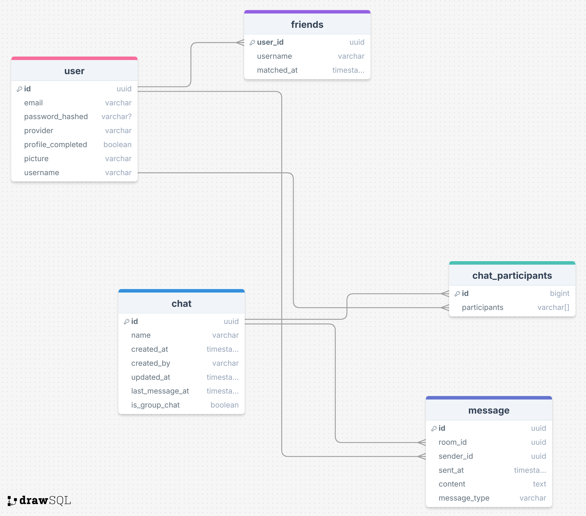

# Chat App

A modern, real-time chat application built with a microservices architecture, designed for scalability and performance.

## 🚀 Project Overview

This project is a full-stack chat application featuring a decoupled frontend and backend, orchestrated via Kubernetes. It leverages modern web technologies to provide a seamless user experience with real-time messaging capabilities.

## 🛠️ Tech Stack

### Frontend (`app/frontend`)
- **Framework**: React 19
- **Build Tool**: Vite
- **Styling**: TailwindCSS 4
- **Language**: TypeScript

### Backend (`app/backend`)
- **Runtime**: Node.js
- **Framework**: Fastify
- **Language**: TypeScript
- **Real-time**: WebSocket (ws / Socket.io)
- **Database**: PostgreSQL
- **Message Broker**: Kafka (for scalable message processing)
- **Authentication**: Google OAuth, JWT

### Infrastructure
- **Containerization**: Docker
- **Orchestration**: Kubernetes (K8s)
- **Management**: Make

## 📂 Project Structure

This is a monorepo workspace managed by npm:

```
.
├── app/
│   ├── frontend/       # React application
│   └── backend/        # Node.js/Fastify API & WebSocket server
├── packages/
│   └── common-types/   # Shared TypeScript definitions
├── k8s/                # Kubernetes manifests
├── Makefile            # Project management commands
└── package.json        # Workspace configuration
```

## 🏁 Getting Started

### Prerequisites
- **Node.js** (v20+ recommended)
- **Docker** & **Docker Compose**
- **Kubernetes Cluster** (e.g., Minikube, Docker Desktop K8s)
- **Make**

### Installation

1.  **Clone the repository:**
    ```bash
    git clone <repository-url>
    cd chatapp
    ```

2.  **Install dependencies:**
    ```bash
    npm install
    ```

3.  **Setup Environment Variables:**
    - Copy `.env.example` to `.env` in the root and subdirectories (`app/backend`, `app/frontend`) if needed.
    - `cp .env.example .env`

### Running the Application

#### Local Development (Monorepo)
You can run the frontend and backend in development mode:

```bash
# In one terminal
npm run dev -w app/backend

# In another terminal
npm run dev -w app/frontend
```

#### Docker Build
Build the container images:

```bash
make build
```

#### Kubernetes Deployment
Deploy the application to your local K8s cluster:

```bash
make k8s-config  # Apply ConfigMaps and Secrets
make k8s-deploy  # Apply Deployments and Services
```

To clean up:
```bash
make clean
```

## 📊 Current State Resume

- **Architecture**: Monorepo structure established with `npm workspaces`.
- **Frontend**: React app initialized with Vite and TailwindCSS.
- **Backend**: Fastify server setup with TypeScript, basic structure for routes/controllers.
- **Infrastructure**: Dockerfiles created for both services. Makefile and K8s manifests ready for local deployment.
- **Dependencies**: Key libraries installed (pg, kafkajs, fastify, react-oauth/google).

## 🗺️ Roadmap (MVP Milestones)

Backend MVP
 - created 80% of the backend
 - Have to modify tests

## DataBase diagram


[Changed feature] --> added created_at, status, requester and recipient to friend entity